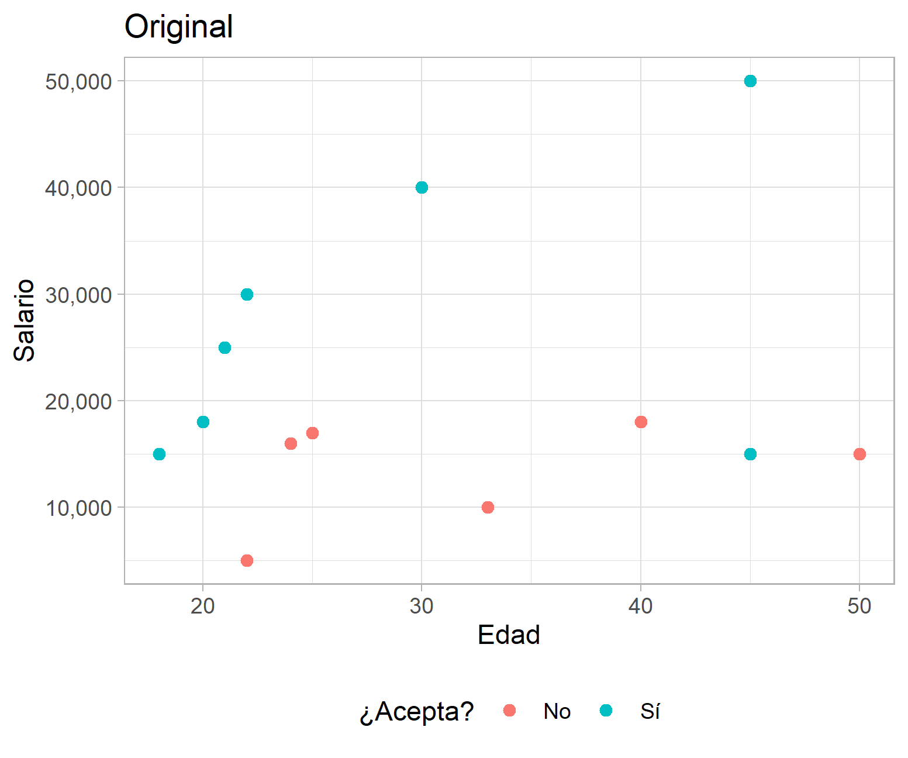
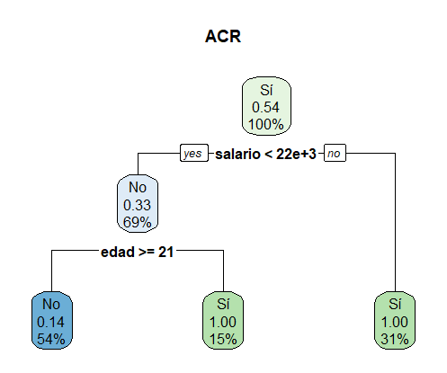

A la hora de escribir las publicaciones del blog siempre he tenido la disyuntiva sobre el balance adecuado entre código y metodología que debo incluir en los post, y aunque la mayoría de las veces me inclino por la opción de abordar las distintas herramientas y hacer simples resúmenes metodológicos, he mantenido un extraño sentimiento de deuda con el lector. 

Por esta razón he decidido iniciar una sección del blog en la que abordaría de manera más formal los detalles de las metodologías que utilizo para algunos ejercicios. No prometo que habrá un orden específico para para esto, algunas veces la metodología llegará primero y la aplicación después y otras veces será lo opuesto. Pero siempre que sienta que pueda hacer un buen trabajo describiendo un tema, haré una nota metodológica.

La primera publicación de este tipo aborda el Random Forest y se dividirán en dos, la primera describiendo en sentido general el algoritmo y otra con detalles sobre algunos elementos complementarios.

## Random Forest

El Random Forest es un algoritmo introducido por Breiman (2001) que se circunscribe en los métodos de ensamblaje.  Esto significa que el modelo depende a su vez de submodelos, de modo que las predicciones e indicadores que arrojan dependen de la combinación de los modelos más pequeños. Estos submodelos que están detrás del Random Forest son los conocidos árboles de clasificación y regresión (ACR) y son la clave para entender a cabalidad esta metodología, de modo que primero introduciremos los ACR y luego la combinación de múltiples árboles que deviene en el Random Forest.

### Arboles de Clasificación y Regresión

Los árboles de clasificación y regresión son modelos que se basan en la partición o subdivisión de los datos para estimar la distribución condicional de la variable dependiente, el cual es un vector $\boldsymbol Y  = (y_1,...,y_n)^t$,  en función de una serie de variables explicativas que forman la matriz $\boldsymbol X = (X_1,...,X_p)$, donde $X_j = (x_{1j},...,x_{nj})$ para $j\ \epsilon \ \{1,...,p\}$. El objetivos de estas subdivisiones es agrupar  $Y$ en función de $\boldsymbol X$ de forma que cada subgrupo sea lo más homogéneo posible.

En el caso de variables dependientes dicotómicas, la operatividad del modelo se encarga de considerar cada valor individual de las variables explicativas como un posible punto de corte binario del espacio, de forma que las áreas que se formen a partir de este punto sean los más homogénea posible en término de la variable dependiente, es decir, que se reduzca la cantidad total de elementos mal clasificados en cada lado.

Para ilustrar lo anterior considere el caso hipotético que se muestra a continuación, en el que se presenta la distribución del salario ofrecido por puestos de trabajo, la edad de los aplicantes y si aceptó o no el empleo. El algoritmo se encarga de buscar un punto en el que al subdividir los datos se minimice la proporción de elementos mal clasificados. En el caso del primer corte, la tasa de error total es del 3/13, pero al agregar un segundo corte según la variable edad se verifica una reducción de la tasa de error total a 1/13. 

#### Ejemplo de un ACR con datos hipotéticos

{width=400px}
{width=400px}
{width=400px}
{width=400px}
<!--
 
 
 
 
 -->

Para decidir si se justifica una segmentación adicional de la data se verifica si este nuevo corte reduciría el error de clasificación, lo que puede ser visto como una especie de función de pérdida. Más formalmente: siendo los datos en un nodo específico $(m)$ del ACR  $\boldsymbol Y^{(m)} = (y_1^{(m)},...,y_{n^{(m)}}^{(m)})$ y $\boldsymbol X^{(m)} = (X^{(m)}_1,..., X^{(m)}_p)$, $X^{(m)}_s$ la variable explicativa que está siendo considerada para agregar un corte a los datos, $C^{(m)}= \{x_i^{(m)} \}_{i ∈\{1,…,n^{(m)}\} }$ los valores únicos y $c ∈C^{(m)}$ la observación considerada para hacer el corte.  Como resultado de esto, el nodo inicial $Y^{(m)}$ queda subdividido en $Y^{(ml)}$ y $Y^{(mr)}$, donde $Y^{(ml)}$ corresponde a todos los elementos de $Y^{(m)}$ para los cuales $X_s^{(m)} ≤ c$  y $Y^{(mr)}$ corresponde a todos los elementos de $Y^{(m)}$ para los que $X_s^{(m)}  > c$. El incremento o disminución del error quedaría definido de la siguiente forma.

$$\Delta(Y^{(m)}) = L(Y^{(m)}) - [\frac{n{(ml)}}{n^{m}}L(Y^{(ml)})\  + \ \frac{n{(mr)}}{n^{m}}L(Y^{(mr)}) ]$$
Esta vez, $n^{(ml)}$ y $n^{(ml)}$ son el número de casos que están a la derecha y a la izquierda del punto de corte, y $L(.)$ es la función de pérdida, la cual se definió intuitivamente en el ejemplo de la figura 1 como la proporción de elementos mal clasificados en cada nodo que se forma con la subdivisión del espacio. En cierto modo la función de pérdida es una medida de impureza.

En el caso de una variable dependiente continua se necesita una función de pérdida un tanto distinta para medir la impureza de la regresión, en estos casos se suele utilizar el error cuadrático medio.

$$L(Y^{(m)}) = \sum_{i=1}^{i=n^{(m)}}{y_{i}^{(m)}- \hat{y}^{(m)}}$$
Donde $\hat{y}^{(m)}$ suele ser el promedio de las observaciones en $Y^{(m)}$.

Una vez elegida la función de pérdida, el algoritmo prosigue de la forma que fue descrita en el ejemplo de la figura 1. Ahora bien, siempre es necesario agregar un criterio de paro para el algoritmo, ya que si no se define uno se podría llegar a un árbol muy complejo en el que no haya impureza pero a costa de un sobreajuste  a los datos de entrenamiento. Esto es así porque teóricamente los ACR pueden crecer hasta que no haya impureza en los nodos resultantes, pero este tipo de resultados suelen llevar a pobres resultados cuando se enfrentan a nueva data. De esta forma, el criterio de paro resulta ser el punto de equilibrio entre un modelo demasiado complejo que se sobreajuste a los datos y un modelo tan sencillo que no resalte elementos importantes. Comúnmente la cantidad de cortes, el número de observaciones y la homogeneidad en los nodos terminales suelen ser buenos criterios de paro, y la elección de uno o varios de estos dependerá del problema que se esté enfrentado y la experiencia del investigador.

 Una vez el árbol de clasificación o regresión ha crecido completamente, el valor predicho para cada observación sería una medida de resumen del nodo en el que se encuentre, para casos de variables respuesta continuas suele utilizarse el promedio, y en el caso de variables respuesta dicotómicas se utiliza la categoría predominante en el nodo o bien un vector de probabilidades para una categoría asignada.

### Múltiple combinación de árboles (Forest)

Según Bierman (1996), la combinación múltiple de árboles (bootstrap aggregating o simplemente bagging) es una técnica que busca reducir la varianza de los valores ajustados de los árboles de regresión, de forma que se reduzca considerablemente el riesgo de sobreajuste que suele caracterizar a los ACR. Esto se logra al correr diferentes modelos y promediar los valores predichos de cada uno para obtener un predictor estandarizado.

El ingenio que hay detrás de estos modelos recae en que cada submodelo se entrena con una remuestra, la cual tiene la misma dimensión que la original, pero es elegida con remplazo o con una rotación, de modo que cada muestra deja fuera una proporción de los datos. El Random Forest se construye al entrenar un ACR con cada una de las remuestras creadas en el bootstrap y los valores predichos de cada observación serán los valores ajustados que dicte cada submodelo que fue creado sin esa observación como parte de la remuestra. Así los valores predichos para cada observación son agregados para producir una estimación combinada que tenga una menor varianza que la que se realiza con un simple ACR (Ver gráfico 2).

#### ACR vs Random Forest

<!-- -->

Además de hacer un proceso de selección aleatoria de las observaciones que serían utilizadas para entrenar los diferentes submodelos, Breiman (2001) extendió esta lógica hacia los predictores, es decir, que cada árbol se entrena con una selección aleatoria de las variables independientes del conjunto de datos original. Esto puede causar escepticismo, pero lo que hay detrás de esta estrategia es evitar que todos los predictores estén siempre en todos los submodelos, de forma que si hay un predictor que es muy importante y en algunos de los modelos es excluido, se haría más fácil el análisis de predictores más débiles, los cuales se ven opacados en los modelos que no hacen este tipo de delimitación.

### Enlaces relacionados 

Como siempre, una lista de las fuentes consultadas y que podría servir para ampliar aún más el contenido. 

- [Random Forest, Breiman 2001](https://www.stat.berkeley.edu/~breiman/randomforest2001.pdf)
- [Baggin predictors, Breiman 1996](https://link.springer.com/content/pdf/10.1007/BF00058655.pdf)
- [Exploratory data analysis using random forest, Zachary Jones y Fridolin Linder 2015](https://pdfs.semanticscholar.org/e7b7/3565b07a7f1369a20b1055f222423f0feb34.pdf)
- [An Introduction to Statistical Learning, capitulo 8](http://faculty.marshall.usc.edu/gareth-james/ISL/ISLR%20Seventh%20Printing.pdf)
- [Random Forest, UC Business Analytics R Programming Guide](http://uc-r.github.io/random_forests)

